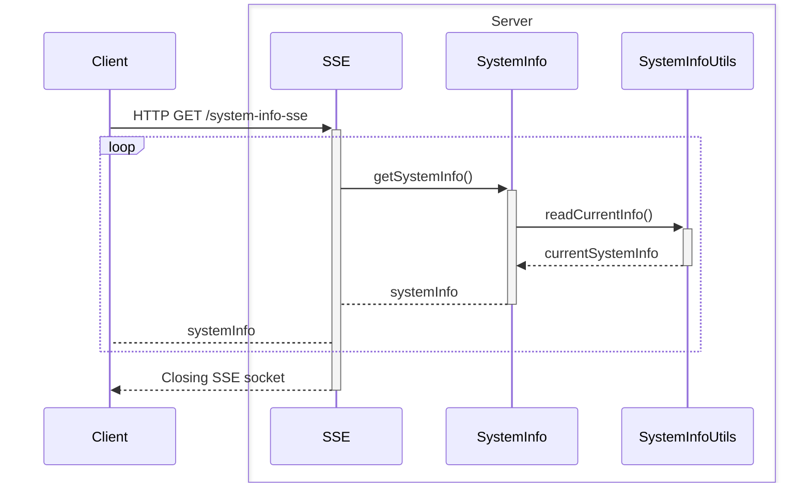
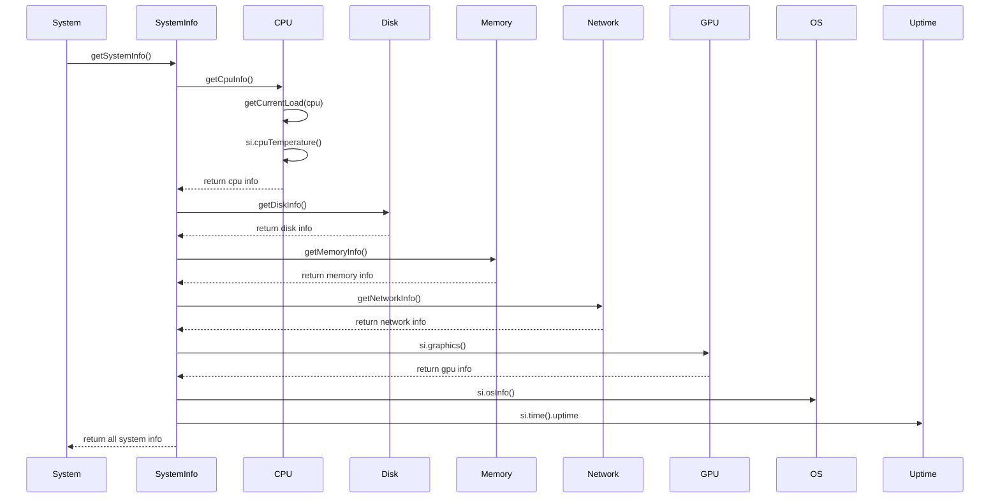

# 🚀 NextJS System Stats

Bem-vindo ao **NextJS System Stats**! Este projeto é uma aplicação desenvolvida com **Next.js** que utiliza **Server-Sent Events (SSE)** para fornecer informações em tempo real sobre o sistema de um Raspberry Pi. 📊

## 📋 Sobre o Projeto

O **NextJS System Stats** é uma ferramenta que permite monitorar o desempenho do seu Raspberry Pi em tempo real. Ele coleta dados sobre o uso da CPU, memória, temperatura e outras métricas importantes, exibindo essas informações de forma dinâmica e atualizada.

## 🛠️ Tecnologias Utilizadas

-   **Next.js**: Um framework React para desenvolvimento de aplicações web modernas.
-   **Server-Sent Events (SSE)**: Uma tecnologia que permite que o servidor envie atualizações automáticas para o cliente, mantendo os dados sempre atualizados.

## 📦 Instalação

Para rodar o projeto localmente, siga os passos abaixo:

1. Clone o repositório:

    ```bash
    git clone https://github.com/DiegoPagotto/nextjs-system-stats
    ```

2. Navegue até o diretório do projeto:

    ```bash
    cd nextjs-system-stats
    ```

3. Instale as dependências:

    ```bash
    npm install
    ```

4. Inicie o servidor de desenvolvimento:
    ```bash
    npm run dev
    ```

## 🚀 Como Usar

Após iniciar o servidor de desenvolvimento, abra o navegador e acesse `http://localhost:3000`. Você verá a interface do **NextJS System Stats** exibindo as informações do sistema em tempo real.

## 📚 Documentação

Você pode encontrar os diagramas da aplicação no diretório `docs/diagrams`

### Fluxo SSE



### Fluxo de leitura de dados do computador



## 📡 Funcionalidades

-   **Monitoramento em Tempo Real**: Veja as métricas do sistema atualizadas em tempo real.
-   **Interface Intuitiva**: Uma interface amigável e fácil de usar.
-   **Tecnologia SSE**: Utiliza Server-Sent Events para manter os dados sempre atualizados sem a necessidade de recarregar a página.

## 🤝 Contribuição

Contribuições são bem-vindas! Sinta-se à vontade para abrir issues e pull requests.

## 📄 Licença

Este projeto está licenciado sob a licença MIT. Veja o arquivo [LICENSE](LICENSE) para mais detalhes.

---

Feito com ❤️ por [Diego Pagotto](https://github.com/DiegoPagotto)
