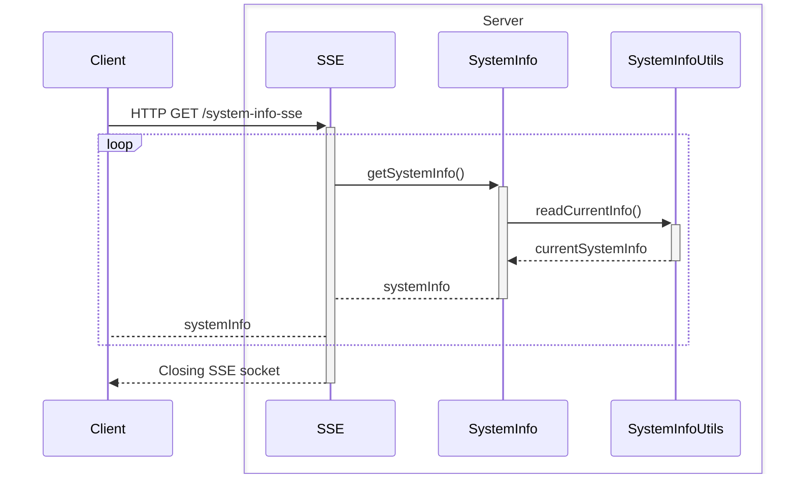

```mermaid
sequenceDiagram
    participant Client
    box Server
        participant SSE
        participant SystemInfo
        participant SystemInfoUtils
    end

    Client ->>+ SSE: HTTP GET /system-info-sse

    loop
        SSE ->>+ SystemInfo: getSystemInfo()
        SystemInfo ->>+ SystemInfoUtils: readCurrentInfo()
        SystemInfoUtils -->>- SystemInfo: currentSystemInfo
        SystemInfo -->- SSE: systemInfo
        SSE --> Client: systemInfo
    end

    SSE -->>- Client: Closing SSE socket
```
