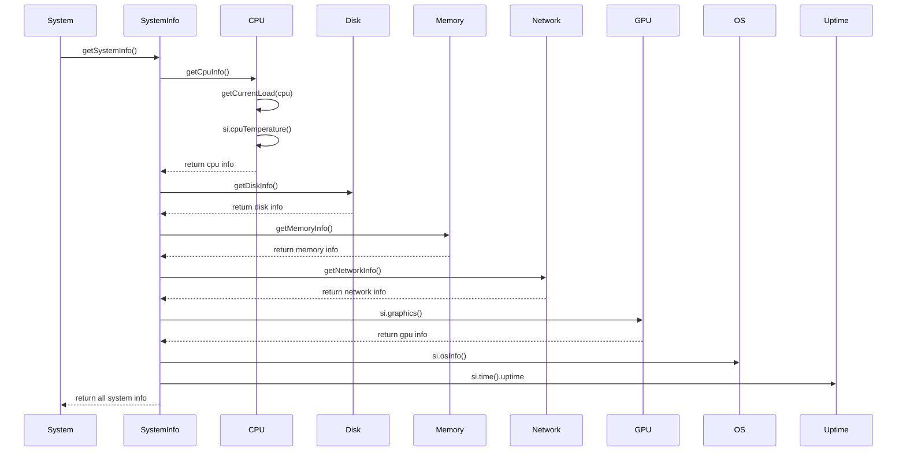

```mermaid
sequenceDiagram
    participant System
    participant SystemInfo

    System->>SystemInfo: getSystemInfo()
    SystemInfo->>CPU: getCpuInfo()
    participant CPU
    CPU->>CPU: getCurrentLoad(cpu)
    CPU->>CPU: si.cpuTemperature()
    CPU-->>SystemInfo: return cpu info

    SystemInfo->>Disk: getDiskInfo()
    participant Disk
    Disk-->>SystemInfo: return disk info

    SystemInfo->>Memory: getMemoryInfo()
    participant Memory
    Memory-->>SystemInfo: return memory info

    SystemInfo->>Network: getNetworkInfo()
    participant Network
    Network-->>SystemInfo: return network info

    SystemInfo->>GPU: si.graphics()
    participant GPU
    GPU-->>SystemInfo: return gpu info

    SystemInfo->>OS: si.osInfo()
    SystemInfo->>Uptime: si.time().uptime
    SystemInfo-->>System: return all system info

```
